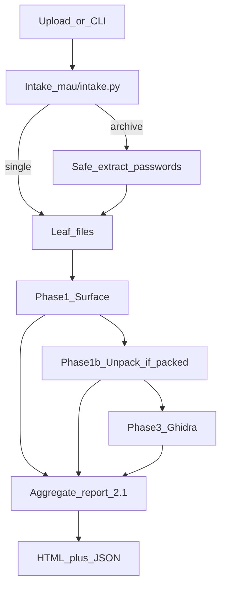

# MalCheck

> ローカル・オフライン運用を前提とした、統合マルウェア解析オーケストレーター

[](#)
[](#)
[](#)
[](#)
[](#)
[](#)

**タグ:** malware-analysis, ghidra, yara, capa, triage, offline, usb-deploy, reverse-engineering

---

## MalCheck とは

MalCheck は、以下のフェーズを統合実行する **フェーズ指向マルウェア解析オーケストレーター** です。

- **Intake** — ZIP/7z の安全展開（パスワード `infected` 等）、ネスト上限、子ファイルごとの再解析
- **Phase 1 - 表層解析** — ハッシュ、文字列、IOC、YARA/capa、DIE、**pefile / oletools / pdfid**
- **Phase 1b - アンパック（PE）** — パック疑い時に UPX / unipacker を自動試行 → 成功時は展開体 + OEP を Ghidra へ
- **Phase 2 - 動的解析コントラクト** — hook first（既定は `skipped`）。実挙動は REMnux 側運用を想定
- **Phase 3 - 静的解析** — ネットワーク隔離 Ghidra headless → **`analysis.json`**（CFG・耐解析ヒューリスティック・関数別デコンパイル）

出力は次の2系統です。

- **機械可読な JSON レポート**（schema **2.1**：`intake.children[]` / `malicious_findings`）
- **アナリスト向け HTML レポート**（悪性検出時は警告バナー + Ghidra サマリ）

MalCheck は **ローカル環境・エアギャップ環境** での運用を想定し、マルウェア解析向けの安全境界を明示的に維持します。旧 Cyber Ghidra WebUI の Ghidra 出力契約は MalCheck に統合済み（React UI は移植していません）。

### パイプライン概要



英語版が必要な場合は [`README_JP.md`](README_JP.md) を参考に、今後 `README.md` の英訳版を追加してください。

---

## プロダクトとしての位置づけ

MalCheck は「統合解析の母艦」です。

- フェーズ制御とレポート契約は `mau/` に集約
- 静的解析/RE機能は段階的に統合
- 一発の大改修ではなく、スライス単位で進化

現行アーキテクチャとロードマップ:

- [`docs/architecture.html`](docs/architecture.html)
- [`docs/milestones.html`](docs/milestones.html)
- [`docs/re-analysis-pipeline.html`](docs/re-analysis-pipeline.html)（アンパック・耐解析・FLOSS の RE パイプライン）
- [`docs/capability-analysis.html`](docs/capability-analysis.html)（表層・動的・静的の機能一覧と推奨ロードマップ）
- [`docs/feature-analysis.html`](docs/feature-analysis.html)（機能マップ・シーケンス図・拡張子別挙動）
- [`docs/static-analysis-schema.html`](docs/static-analysis-schema.html)（Ghidra `analysis.json`）
- [`docs/implementation-rules.html`](docs/implementation-rules.html)
- [`docs/development-diary.html`](docs/development-diary.html)

---

## 主な機能

### 1) フェーズ指向パイプライン

`mau.phase_router.run_pipeline_with_intake()`（Web UI / 推奨 CLI）は次を制御します:

- `intake` -> アーカイブ解凍・子ファイルステージング（`samples/_intake/`）
- `surface` -> 高速トリアージ（pefile 耐解析、FLOSS、capa anti-analysis 要約）
- `unpack` -> パック疑い PE のみ UPX / unipacker（`phase1b_unpack`）
- `dynamic` -> skipped / not_implemented / hook 結果
- `static` -> Ghidra headless → `phase3_static.analysis_json` + `re_analysis` ロールアップ

単一ファイルのみの場合は `run_pipeline()` も利用可能。各フェーズの失敗は分離され、レポートへ構造化記録されます。

### 2) オフラインファースト運用

- USB/オフライン配布向けスクリプトを同梱
- Windows/Linux のエアギャップ導入パスを用意
- Ghidra静的解析はデフォルトでネットワーク隔離

### 3) レポート中心設計

すべての実行で、構造化レポートを生成します。

- `results/reports/<sample>.json`
- `results/reports/<sample>.html`

現行レポート契約の代表項目:

- `meta.schema_version`（**2.1**）
- `intake` / `malicious_findings`（アーカイブ・子ファイル集約時）
- `phase_status.surface/dynamic/static`
- `phase3_static.summary`（関数数・suspicious API・truncated）
- `phase3_static.analysis_json`（Ghidra 詳細 JSON、HTML では折りたたみ表示）

### 4) 拡張可能な動的解析連携

動的解析は意図的に hook first です。

- 安全な既定値: disabled（`skipped`）
- hook 未設定で enabled: `not_implemented`
- `MAU_DYNAMIC_HOOK` 使用時: 正規化された dynamic payload

---

## クイックスタート

### A. ローカル Docker 実行

```text
docker compose up -d
```

オーケストレーターから検体を1件実行:

```text
docker exec orchestrator python -m mau.main suspect.exe
```

Web UI（`archive_password` 既定 `infected`）:

```text
http://127.0.0.1:8080
```

CLI（アーカイブ対応）:

```text
python -m mau.main suspect.zip --archive-password infected
```

### B. FLARE VM / オフライン運用（Windows）

1. ネット接続可能な端末でイメージ準備
   - `ghidra_11.4.3_PUBLIC_20251203.zip` を `build/ghidra-headless/` に配置
   - 次を実行:
   ```text
   bash make_usb.sh
   ```
2. オフライン解析端末で実行:
   ```text
   deploy.bat
   ```
3. 解析実行:
   ```text
   copy suspect.exe samples\
   docker exec orchestrator python -m mau.main suspect.exe
   ```

停止:

```text
docker compose -f docker-compose.usb.yml --env-file compose\.env.runtime down
```

---

## Surface イメージの再ビルド（M-U2 以降）

PE/Office/PDF 用の `pefile` / `oletools` / `pdfid` を surface コンテナに含めます。依存を更新したらリポジトリルートで:

```text
docker compose build surface-analyzer
```

（`containers/surface/Dockerfile` は `scripts/remnux/format_scanners.py` を `/scripts/` に COPY します。）

---

## Ghidra イメージのビルド

Ghidra ZIP を `build/ghidra-headless/` に配置したうえで、静的解析イメージをビルドします（リポジトリルートから）:

```text
docker build -t ghidra-headless:latest -f build/ghidra-headless/Dockerfile build/ghidra-headless
```

既定では **1 回**の headless 実行で `auto_analyze.py` が `/output/analysis.json` を生成します（CFG・コールグラフ・関数別デコンパイルを含む）。レガシー 3 パス出力が必要な場合はコンテナに `MAU_GHIDRA_LEGACY=1` を渡します。

スキーマ正本: [`docs/static-analysis-schema.html`](docs/static-analysis-schema.html)

このイメージが無い場合、Static フェーズは `status: failed` を記録しますが、他フェーズのレポート生成は継続します。

---

## 設定

主設定ファイル:

- `compose/config/analyzer.yaml`

環境変数での上書き:

- `MAU_CONFIG=<path-to-yaml>`

影響度の高いキー:

- `phases.dynamic.enabled`
- `phases.static.ghidra_image`
- `report.executive_summary_llm`
- `ollama.base_url`
- `ollama.model`
- `intake.enabled`, `intake.passwords`, `intake.max_extract_mb`

---

## テスト

ホスト側テストコマンド:

```text
pip install -r requirements-dev.txt
pytest tests -v
```

現行テストで確認している内容:

- 設定ロード / マージ挙動
- intake（ZIP / AES `infected` パスワード）
- 表層解析 JSON コントラクト / format scanners
- 静的出力正規化（`mau/static_normalize.py`、Ghidra 不要）
- レポート集約・verdict 昇格（子ファイル max score）
- dynamic hook 出力の正規化
- CLI のエラー / 終了コード挙動

---

## セキュリティ / OPSEC 境界

MalCheck はマルウェア解析用途です。検体由来データはすべて不正入力として扱ってください。

- Do not commit samples, payloads, or IOC-heavy artifacts
- Do not add automatic online IOC enrichment by default
- Keep static/Ghidra containers network-isolated
- Keep dynamic detonation opt-in and lab-backed

See full rules in [`docs/implementation-rules.html`](docs/implementation-rules.html).

---

## リポジトリ構成

```text
mau/                     # orchestrator, intake, report, static_normalize
scripts/remnux/          # surface analyze.py + format_scanners.py
scripts/ghidra/            # auto_analyze.py (canonical; copied into image)
build/ghidra-headless/     # Ghidra Docker image + entrypoint
containers/surface/      # surface-analysis container
web_ui/                  # FastAPI + Jinja web interface
compose/config/          # runtime analyzer config (intake.*)
rules/yara/              # YARA rules
tests/                   # pytest suite
docs/                    # HTML canonical documentation
```

---

## ロードマップ概要

完了済み（2026-06）:

- **M-U** — アーカイブ intake、PE/Office/PDF scanners、集約レポート 2.1
- **M2** — `auto_analyze.py` / `analysis.json`、Ghidra 1-pass、cyber-ghidra 退役

次の候補:

1. レポート HTML の Web 配信（パス表示のみ → ブラウザで直接閲覧）
2. IOC 拡充・エクスポート（STIX/CSV）
3. Dynamic hook / 任意 CAPE 連携

詳細: [`docs/milestones.html`](docs/milestones.html)

---

## 利用上の注意

このリポジトリは、防御目的の研究、リバースエンジニアリング、管理されたラボ運用を想定しています。  
マルウェア解析を行う法的権限と運用体制がある環境でのみ利用してください。
