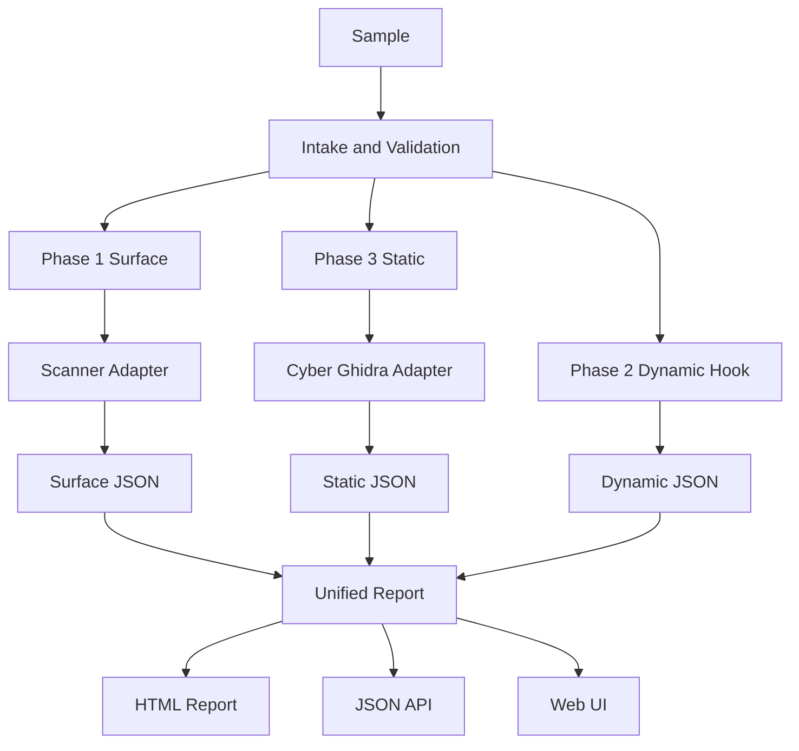

# MalCheck Integrated Architecture

Last updated: 2026-06-02

## Purpose

MalCheck is the long-term home for a unified malware analysis workflow. The goal is to keep MalCheck's phase-based orchestration and report generation, while bringing in the strongest parts of Cyber Ghidra WebUI: richer Ghidra JSON, static scanner plugins, unpacking, and reverse-engineering focused UI patterns.

The target product is not a live Ghidra replacement. It is an offline-friendly analysis orchestrator that accepts a sample, runs surface/static/dynamic phases under explicit safety boundaries, and produces machine-readable JSON plus analyst-friendly reports.

## Current Baseline

MalCheck already has the core orchestration shape:

- `mau.phase_router.run_pipeline()` runs `surface`, `dynamic`, and `static` phases.
- `mau.surface_runner` delegates surface analysis to a Docker container or local fallback.
- `mau.dynamic_analyzer` is a structured stub with optional `MAU_DYNAMIC_HOOK`.
- `mau.static_analyzer` launches a network-isolated Ghidra container.
- `mau.report_generator` creates JSON and HTML reports.
- `web_ui.app` provides a minimal upload-and-run FastAPI UI.

Cyber Ghidra WebUI contributes capabilities that MalCheck should selectively absorb:

- Rich `*_analysis.json` from `scripts/ghidra/auto_analyze.py`.
- Function-level decompile data, CFG, xrefs, call graph, suspicious API extraction, and line-address mapping.
- MIME-routed scanner plugins for PE, ELF, Mach-O, PDF, Office, APK, binwalk, capa, LIEF, pefile, oletools, and pdfid.
- Stronger reverse-engineering UI concepts such as function trees, graph views, xref panels, and history reopening.
- Safer upload routing for archives and non-native documents.

## Guiding Decisions

1. MalCheck remains the parent project.
   The phase router, report shape, USB/offline workflow, and CLI entry point stay in MalCheck.

2. Cyber Ghidra is mined for engines and UI concepts, not copied wholesale.
   Integrate the scanner runner, Ghidra export schema, and selected UI patterns incrementally.

3. The unified report is the stable contract.
   Every phase writes structured JSON. UI and reports read that JSON rather than reaching into tool-specific temporary files.

4. Dynamic analysis is staged.
   The first milestone formalizes a JSON hook contract. CAPE/VM/FakeNet integration is a later milestone, not part of the first usable version.

5. Network isolation is a hard boundary.
   Ghidra/static analysis containers must keep `network_mode: none` or equivalent isolation. Dynamic analysis requires a dedicated lab network.

## Target Pipeline



## Unified Report Contract

The report must remain backward compatible with the current MalCheck keys while adding richer subdocuments.

```json
{
  "meta": {
    "schema_version": "2.0",
    "timestamp": "...",
    "sample_name": "sample.exe"
  },
  "verdict": {
    "label": "suspicious",
    "score": 45,
    "reasons": []
  },
  "phase1_surface": {
    "hashes": {},
    "file_type": "...",
    "strings_sample": [],
    "urls": [],
    "ips": [],
    "scanner_results": []
  },
  "phase2_dynamic": {
    "status": "skipped",
    "network": {},
    "processes": [],
    "filesystem": [],
    "registry": []
  },
  "phase3_static": {
    "engine": "cyber_ghidra",
    "analysis_json": {},
    "summary": {}
  },
  "iocs": {},
  "mitre_mapping": []
}
```

## Phase Responsibilities

### Phase 1: Surface

Surface analysis should be fast, resilient, and safe to run before deep static analysis.

Responsibilities:

- Hashes and file type.
- Strings sample and simple IOC extraction.
- Entropy and packer hints.
- YARA and capa results.
- MIME-specific scanner results once Cyber Ghidra scanner plugins are adapted.

Non-goals:

- Full decompilation.
- Internet lookups.
- Live detonation.

### Phase 2: Dynamic

The dynamic phase is currently a contract, not a full sandbox.

Initial responsibility:

- Return `skipped`, `not_implemented`, `error`, or hook-produced JSON in a stable shape.
- Accept JSON from `MAU_DYNAMIC_HOOK`.
- Display the dynamic status clearly in HTML/UI.

Future responsibility:

- CAPEv2 API integration or a dedicated VM controller.
- Network, process, registry, filesystem, screenshot, and PCAP summaries.

### Phase 3: Static

Static analysis should migrate toward Cyber Ghidra's richer JSON.

Responsibilities:

- Run Ghidra headless in an isolated container.
- Produce function-level decompile data.
- Export imports, strings, exports, suspicious APIs, CFG, xrefs, and call graph where available.
- Preserve legacy MalCheck summary fields during migration.

Non-goals:

- Interactive Ghidra project editing.
- Symbol renaming or type edits from the Web UI.
- Network access from the static analysis container.

## Integration Options

### Recommended Short-Term Path

Use MalCheck as the orchestrator and integrate Cyber Ghidra engines through adapters:

- `surface_scanner_adapter`: converts Cyber Ghidra scanner results into `phase1_surface.scanner_results`.
- `cyber_ghidra_static_adapter`: runs or imports Cyber Ghidra-compatible `analysis_json` into `phase3_static`.
- `report_schema_v2`: lets report/UI code consume both old and new phase payloads.

### Avoid Initially

- Running both MalCheck Ghidra and Cyber Ghidra Ghidra pipelines in parallel.
- Rebuilding the whole application as microservices before the report schema is stable.
- Implementing a custom VM sandbox before the dynamic JSON contract is tested.

## Safety Model

- Treat every sample and extracted string as hostile data.
- Do not fetch, resolve, ping, or enrich extracted IOCs online by default.
- Keep static/Ghidra analysis network-isolated.
- Keep dynamic analysis disabled unless an explicit hook or sandbox backend is configured.
- Do not commit samples, generated reports containing real IOCs, API keys, or local secrets.
- Prefer local/offline analysis paths for malware workflows.

## Open Questions

- Should the first UI step stay Jinja-only, or should a React analysis view be introduced early?
- Should the Cyber Ghidra static adapter run as a child Docker container, a service API, or a direct script inside the current Ghidra image?
- Should capa run in Phase 1 only, Phase 3 only, or be deduplicated through a shared result cache?
- What is the minimum accepted dynamic hook schema for external sandbox integration?
