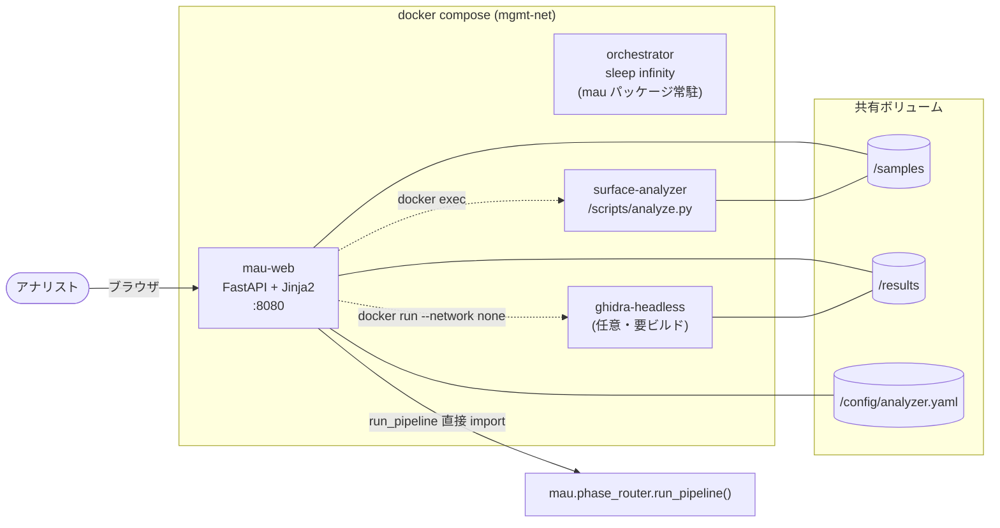
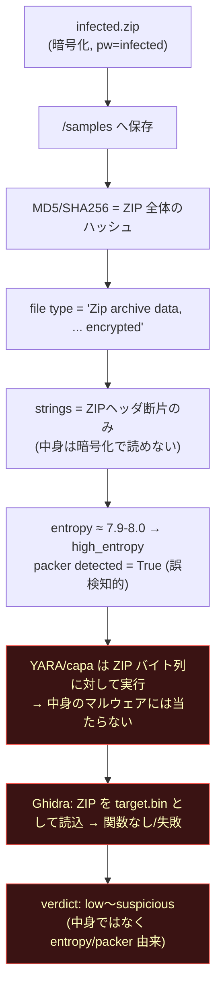
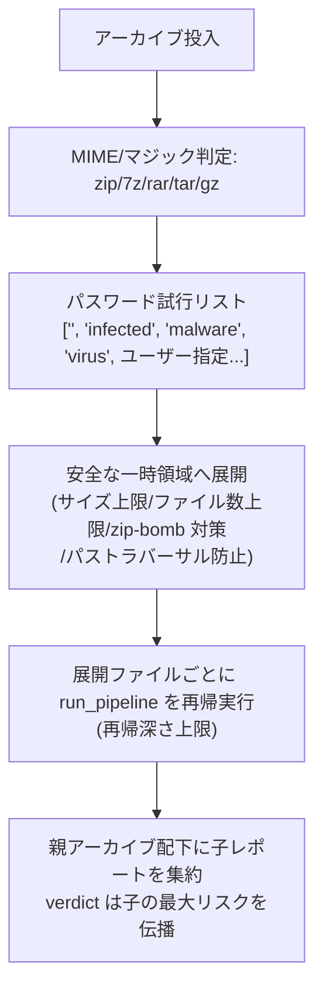
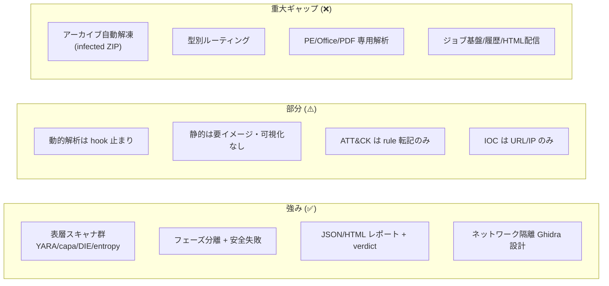

# MalCheck 機能分析・理想比較レポート

最終更新: 2026-06-02
対象コミット時点の実装（`mau/`, `scripts/remnux/analyze.py`, `web_ui/`, `compose/config/analyzer.yaml`）に基づく。

このドキュメントは次の3点を扱う。

1. 現行機能のマークダウン図（機能マップ・シーケンス図・ボタン操作コードフロー図）
2. 「理想のマルウェア解析ツール」との機能比較
3. 検体投入後の挙動分析（拡張子別・特に「infected」パスワード付き ZIP の自動解凍/解析の有無）

> 注意: 本書は実装の事実を記述する。検体由来の文字列・IOC は敵対的データとして扱う前提（`08-ai-opsec`）であり、設計上もオンライン照会は行わない。

---

## 1. 現行アーキテクチャと機能マップ

### 1.1 コンポーネント構成



補足:
- Web UI は `mau.phase_router.run_pipeline` を**同一プロセス内で直接呼び出す**（HTTP 越しに orchestrator を叩く構成ではない）。`orchestrator` コンテナは CLI 実行用に常駐しているが、Web 経路では surface コンテナへの `docker exec` と Ghidra の `docker run` を web コンテナ自身が Docker ソケット経由で行う。
- 解析は同期実行（キュー/ジョブ管理なし、1リクエスト1解析）。

### 1.2 機能マップ（実装済み / 部分 / 未実装）

```mermaid
flowchart TD
    root["MalCheck"]

    root --> intake["取り込み"]
    intake --> i1["ファイル保存 (samples)"]
    intake --> i2["ファイル名サニタイズ"]
    intake --x i3["アーカイブ自動解凍 ❌"]
    intake --x i4["拡張子/MIME ルーティング ❌"]

    root --> p1["Phase 1 表層解析 ✅"]
    p1 --> s1["MD5 / SHA256"]
    p1 --> s2["file type (libmagic/file)"]
    p1 --> s3["ASCII strings 抽出"]
    p1 --> s4["IOC: URL / IPv4"]
    p1 --> s5["エントロピー"]
    p1 --> s6["DIE パッカー検出"]
    p1 --> s7["YARA (rules_dir)"]
    p1 --> s8["capa"]
    p1 --> s9["scanner_results 正規化 + overall_risk"]

    root --> p2["Phase 2 動的解析 ⚠️"]
    p2 --> d1["既定 disabled"]
    p2 --> d2["MAU_DYNAMIC_HOOK で外部スクリプト"]
    p2 --x d3["サンドボックス/CAPE 本体 ❌"]

    root --> p3["Phase 3 静的解析 ⚠️"]
    p3 --> t1["Ghidra headless (要イメージ)"]
    p3 --> t2["decompiled.c / functions.json / metadata.json"]
    p3 --> t3["network none + mem 制限"]
    p3 --x t4["CFG/コールグラフ/xref UI ❌ (MalCheck 側)"]

    root --> rep["レポート ✅"]
    rep --> r1["JSON (schema 2.0)"]
    rep --> r2["HTML"]
    rep --> r3["ヒューリスティック verdict/score"]
    rep --> r4["IOC 集約"]
    rep --> r5["MITRE: capa rule 名のみ ⚠️"]
    rep --> r6["Ollama 要約 (任意)"]

    root --> ui["Web UI ⚠️"]
    ui --> u1["アップロード / Analyze"]
    ui --> u2["verdict + raw JSON 表示"]
    ui --x u3["レポート HTML 直リンク配信 ❌"]
    ui --x u4["履歴 / 検索 / 関数ブラウザ ❌"]
```



凡例: ✅ 実装済み / ⚠️ 部分的・要前提 / ❌ 未実装

---

## 2. シーケンス図（検体投入 → レポート）

```mermaid
sequenceDiagram
    autonumber
    actor U as アナリスト
    participant B as ブラウザ (index.html)
    participant W as FastAPI (/analyze)
    participant PR as phase_router.run_pipeline
    participant SR as surface_runner
    participant SC as surface-analyzer (docker exec)
    participant DY as dynamic_analyzer
    participant ST as static_analyzer
    participant GH as ghidra-headless (docker run)
    participant RG as report_generator
    participant FS as /results/reports

    U->>B: ファイル選択 → Analyze クリック
    B->>W: POST /analyze (multipart FormData)
    W->>W: ファイル名検証 + /samples に保存
    W->>PR: run_pipeline(dest, sample_name)
    PR->>PR: load_config(analyzer.yaml)

    rect rgb(20,40,60)
    note over PR,SC: Phase 1 表層解析 (enabled)
    PR->>SR: run_surface_analysis()
    SR->>SC: exec python3 /scripts/analyze.py /samples/<file>
    SC-->>SR: JSON (hashes, strings, IOC, scanners...)
    SR-->>PR: surface dict
    end

    rect rgb(60,50,20)
    note over PR,DY: Phase 2 動的解析 (既定 disabled)
    PR->>DY: run_dynamic_analysis(enabled=False)
    DY-->>PR: {status: skipped}
    end

    rect rgb(40,20,60)
    note over PR,GH: Phase 3 静的解析 (enabled だが要イメージ)
    PR->>ST: run_static_analysis()
    alt Ghidra イメージあり
        ST->>GH: containers.run(target.bin, network none)
        GH-->>ST: decompiled.c / functions.json
        ST-->>PR: static dict
    else イメージ未ロード
        ST-->>PR: StaticError (フェーズ単位で失敗扱い)
    end
    end

    PR->>RG: generate_report(surface, dynamic, static)
    RG->>FS: <name>.json + <name>.html 書き出し
    RG-->>PR: report (+ _paths, verdict)
    PR-->>W: {report, surface, dynamic, static}
    W-->>B: JSON {ok, sample, report_json, report_html, verdict}
    B->>U: verdict ラベル / score / reasons / raw JSON 表示
```



ポイント:
- 各フェーズは `try/except` で隔離され、1フェーズの失敗が全体を止めない（static の Ghidra 未ロードは `failed` として記録され surface 結果は残る）。
- HTML レポートは生成されるが、`report_html` は**コンテナ内パス文字列**として返るだけで、UI から直接開けるエンドポイントは無い。

---

## 3. ボタン操作コードフロー図

ユーザーの 2 つの操作（「ファイルを選択」「Analyze」）からコードまでの流れ。

```mermaid
flowchart TD
    subgraph FE["フロントエンド index.html"]
        click1["『ファイルを選択』クリック"] --> lbl["label[for=file] が<br/>hidden input をトリガ"]
        lbl --> change["input.onchange"] --> fname["filename 表示更新"]

        click2["『Analyze』クリック"] --> submit["form.onsubmit"]
        submit --> prevent["preventDefault()"]
        prevent --> disable["submit 無効化 + '解析中…'"]
        disable --> fetch["fetch POST /analyze<br/>(FormData)"]
        fetch --> resp{"r.ok?"}
        resp -- いいえ --> flash["flash にエラー表示"]
        resp -- はい --> render["verdict ラベル(色分け)<br/>score / reasons / paths / raw JSON"]
    end

    subgraph BE["バックエンド app.py /analyze"]
        fetch --> v1["filename 必須チェック"]
        v1 --> v2["'..' / 先頭'/' 拒否"]
        v2 --> save["tempfile → /samples/<safe_name> へ move"]
        save --> call["run_pipeline(dest, sample_name)"]
        call --> ok{"例外?"}
        ok -- はい --> del["dest.unlink() + HTTP 500"]
        ok -- いいえ --> ret["JSON 応答<br/>(report_json/html, verdict)"]
    end

    subgraph PIPE["パイプライン phase_router"]
        call --> ph1["Phase1 surface"]
        ph1 --> ph2["Phase2 dynamic"]
        ph2 --> ph3["Phase3 static"]
        ph3 --> rep["report_generator → JSON/HTML"]
        rep --> ret
    end

    render --> done([完了])
    flash --> done
    del --> done
```

UI が扱う `/analyze` 応答フィールド: `ok`, `sample`, `report_json`, `report_html`, `verdict{label,score,reasons}`。
（surface/dynamic/static の本体や `phase_status` は応答に含めず、レポートファイル側にのみ存在する。）

---

## 4. 検体投入後の挙動分析（拡張子別）

### 4.1 重要な事実: 入力は型に依らず単一経路

現行実装には**拡張子判定も MIME ルーティングも存在しない**。`/analyze` は受け取ったファイルをそのまま `/samples` に置き、`analyze.py` が中身を「バイト列」として扱う:

- ハッシュ、`file`/libmagic による型推定（**表示のみ**。後続処理の分岐には使わない）
- 先頭 4MB から ASCII strings → URL/IPv4 抽出
- エントロピー（>7.2 で「high entropy」= packer detected=True 扱い）
- DIE / YARA / capa を**ファイル全体**に対して実行

Ghidra 静的解析も型に関係なく `target.bin` として読み込むため、PE/ELF 以外は基本的に意味のある関数が出ない（フェーズ失敗または空に近い結果）。

### 4.2 拡張子別の実際の挙動

| 投入ファイル | file type 表示 | strings/IOC | entropy 判定 | YARA/capa | Ghidra 静的 | 実用度 |
|---|---|---|---|---|---|---|
| PE (.exe/.dll) | 正しく PE 表示 | ◯（PE 内文字列） | パック時 high | YARA◯ / capa はPE向きで◯ | ◯（本来の対象） | **高** |
| ELF / Mach-O | 正しく表示 | ◯ | 場合による | YARA◯ / capa一部 | ◯ | 中〜高 |
| スクリプト (.js/.ps1/.vbs/.py) | text 系表示 | ◯（コードが平文） | 低 | YARA◯ / capa✕ | ✕（コード逆コンパイル対象外） | 中（strings/YARA のみ） |
| Office (.doc/.docx/.xlsm) | 表示のみ | △（OOXML は zip 圧縮で平文化されず） | docx は high | マクロ専用解析 ✕ | ✕ | **低**（olevba 等が無い） |
| PDF (.pdf) | 表示のみ | △ | 中 | PDF 専用解析 ✕ | ✕ | **低**（pdfid/pdf-parser が無い） |
| 非暗号 ZIP/7z/tar | "Zip archive" 等 | ✕（圧縮データ） | high（≒8.0）→packer flag | 中身に当たらない | ✕ | **低**（解凍しない） |
| 暗号化 ZIP「infected」 | "Zip ... encrypted" | ✕ | high → packer flag | 中身に当たらない | ✕ | **ほぼ無**（後述） |
| 生 shellcode (.bin) | data | ◯（部分） | high | YARA◯ | ✕（PE/ELF前提） | 低〜中 |

凡例: ◯ 有効 / △ 限定的 / ✕ 実質機能しない

### 4.3「infected」パスワード付き ZIP を投入した場合（自動解凍・解析の有無）

結論: **自動解凍は行われない。パスワード `infected` の試行も無い。中身は一切解析されない。**

実際に起きること（コードパス: `app.py /analyze` → `analyze.py analyze()`）:



つまり、`infected.zip` を投げても得られるのは「暗号化 ZIP である」という外形情報と、エントロピー由来の弱い疑い評価のみで、**梱包されたマルウェア本体は解析されない**。マルウェア配布で常用される `infected` パスワード ZIP に対して、現状ツールは triage 価値をほぼ提供できない。これは優先度の高い機能ギャップ。

#### あるべき挙動（推奨設計）



実装上の必須ガード: 解凍サイズ上限・展開ファイル数上限・再帰深さ上限（zip bomb）、パストラバーサル無害化、展開物は隔離領域のみ、ネットワーク無し。`pyzipper`/`py7zr`/`rarfile` 等の導入を検討。

---

## 5. 理想のマルウェア解析ツールとの比較

「理想」は、表層 → 静的 → 動的を横断する triage プラットフォーム（REMnux + CAPE + 静的RE + 脅威インテリ連携）を基準にする。

### 5.1 機能比較表

| 領域 | 理想機能 | MalCheck 現状 | 判定 |
|---|---|---|---|
| 取り込み | 型判定・ハッシュ | file/libmagic + MD5/SHA256 | ✅ |
| 取り込み | ファジーハッシュ (ssdeep/TLSH/imphash) | なし | ❌ |
| 取り込み | MIME/拡張子ルーティング | なし（単一経路） | ❌ |
| 取り込み | アーカイブ自動解凍（pw `infected` 含む） | **なし** | ❌ |
| 取り込み | 再帰展開 + 子検体ファンアウト | なし | ❌ |
| 表層 | strings / IOC 抽出 | URL/IPv4（domain/email/registry/mutex なし） | ⚠️ |
| 表層 | エントロピー / パッカー検出 | entropy + DIE | ✅ |
| 表層 | YARA / capa | 両方あり | ✅ |
| 表層 | PE/ELF ヘッダ解析（imports/exports/sections/Authenticode） | なし（型は表示のみ） | ❌ |
| 表層 | ドキュメント解析（olevba/oletools, pdfid） | なし | ❌ |
| 静的 | 逆コンパイル（Ghidra） | あり（要イメージ） | ⚠️ |
| 静的 | CFG / コールグラフ / xref / suspicious API | MalCheck 単体は JSON 受領のみ、可視化UIなし | ⚠️ |
| 静的 | 検体間 diff | なし | ❌ |
| 動的 | サンドボックス実行（CAPE/Cuckoo） | hook のみ、本体なし | ⚠️ |
| 動的 | API フック / 挙動 / メモリダンプ / config 抽出 | なし | ❌ |
| 動的 | ネットワークシミュレーション（INetSim） | なし | ❌ |
| 脅威インテリ | ATT&CK / MBC マッピング | capa rule 名を転記のみ（正規 TTP 紐付けなし） | ⚠️ |
| 脅威インテリ | IOC エンリッチ（オフライン） | なし（オンライン照会は方針上も禁止） | ❌ |
| レポート | JSON + HTML | あり（schema 2.0） | ✅ |
| レポート | verdict / スコアリング | ヒューリスティック加点 | ⚠️ |
| レポート | IOC エクスポート（STIX/MISP/CSV） | なし | ❌ |
| レポート | LLM 要約 | Ollama 任意 | ✅ |
| 基盤 | ジョブキュー / 並列 | なし（同期1件） | ❌ |
| 基盤 | 履歴 / 検索 / 認証 | なし | ❌ |
| 基盤 | ネットワーク隔離 / 検体ゼロ化 | Ghidra は network none。検体の自動削除/ゼロ化は未整備 | ⚠️ |
| UI | アップロード / 結果表示 | あり（GitHub 風） | ✅ |
| UI | レポート HTML 直接表示 / 関数ブラウザ | なし（パス文字列のみ） | ❌ |

判定: ✅ 充足 / ⚠️ 部分・要前提 / ❌ 欠落

### 5.2 カバレッジの俯瞰



---

## 6. 優先度付き改善提案

理想との差分から、triage 実用性への寄与が大きい順:

1. **アーカイブ自動解凍 + 型ルーティング（最優先）**
   `infected` を含むパスワード試行、安全展開（zip-bomb/トラバーサル対策）、展開ファイルごとの再帰解析。これが無いと現実の検体配布形態に対応できない。
2. **型別の表層解析強化**
   PE ヘッダ解析（imports/exports/sections/imphash/Authenticode）、Office（olevba）、PDF（pdfid）。`file_type` を表示用から**ルーティングキー**へ昇格。
3. **IOC 拡充 + エクスポート**
   domain/email/registry/mutex 抽出、ssdeep/TLSH、STIX/MISP/CSV 出力（オフライン）。
4. **レポート HTML をブラウザで開けるよう配信**
   `report_html` を静的配信 or 結果ページ統合（現状はパス文字列のみで UX が途切れる）。
5. **ATT&CK 正規マッピング**
   capa の MBC/ATT&CK メタを正規 technique ID へ（`Custom-AttckMapper` 準拠）。
6. **動的解析の本実装（中長期）**
   CAPE/VM + INetSim を `MAU_DYNAMIC_HOOK` 契約の先に接続。
7. **ジョブ基盤 / 履歴 / 検体ライフサイクル管理**
   同期1件 → キュー化、解析後の検体ゼロ化・保持ポリシー。

---

## 付録: 参照したコード

- 取り込み/応答: `web_ui/app.py`（`/analyze`, `index`）
- パイプライン: `mau/phase_router.py`（`run_pipeline`）
- 表層: `mau/surface_runner.py` + `scripts/remnux/analyze.py`（`analyze`）
- 動的: `mau/dynamic_analyzer.py`
- 静的: `mau/static_analyzer.py`
- レポート/判定: `mau/report_generator.py`（`calculate_verdict`, `generate_report`）
- 設定: `mau/config.py`, `compose/config/analyzer.yaml`
- 比較参照: `../cyber-ghidra-webui-main/ROADMAP.md`
